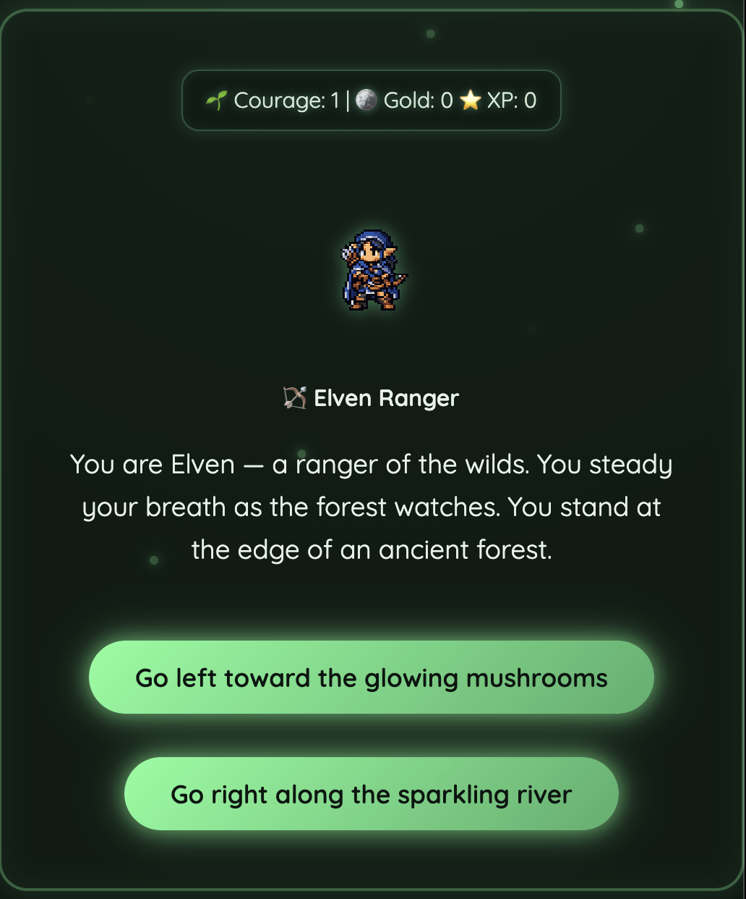
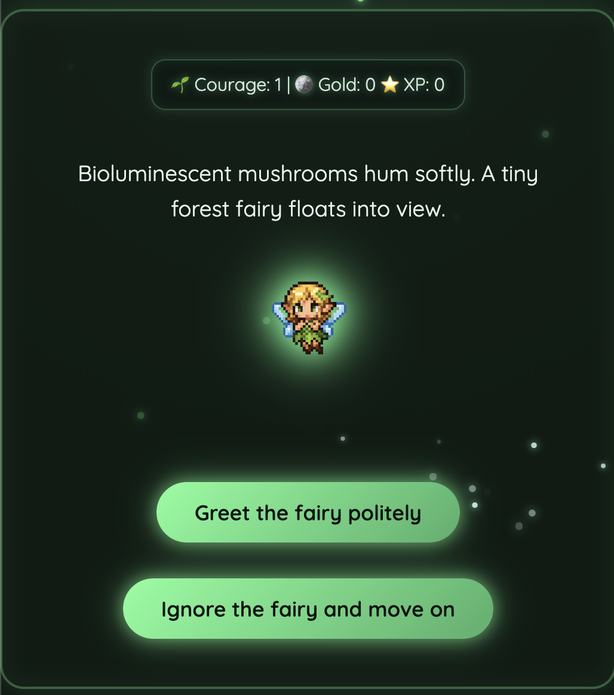
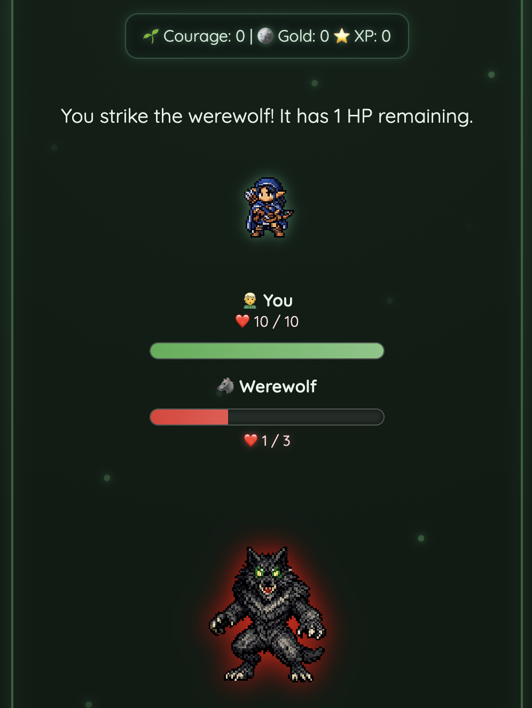
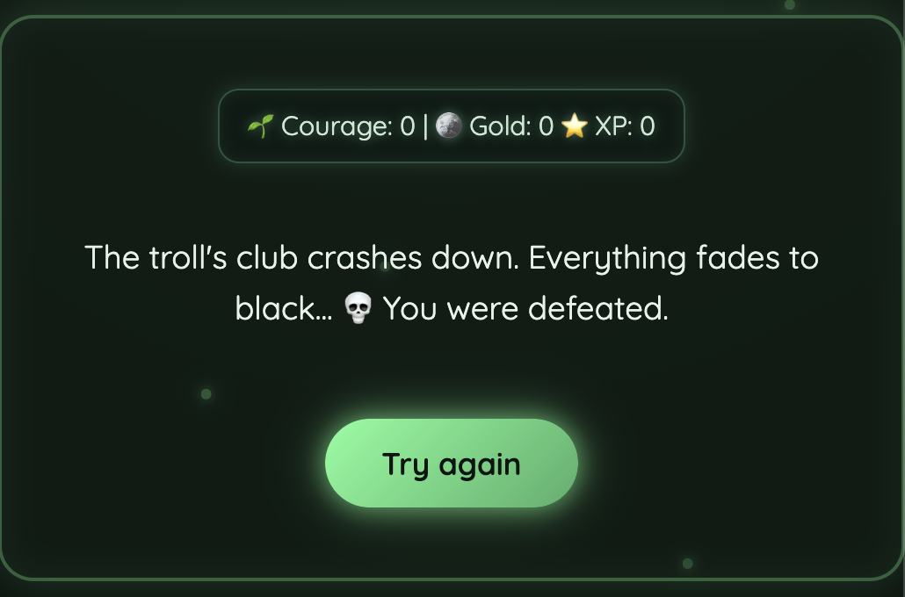

# 🌿 The Mosslit Path

A Flask-based narrative RPG web app where you play as an Elven Ranger 
navigating a branching forest adventure. Your choices shape the story — 
encounters, combat outcomes, and endings all depend on the path you take.


---

## 📸 Screenshots

| Intro | Branching Path | Combat | Ending |
|-------|---------------|--------|--------|
|  |  |  |  |

---

## 🛠️ Tech Stack

| Layer | Technology |
|-------|-----------|
| Backend | Python, Flask |
| Templating | Jinja2 |
| Frontend | HTML, CSS, JavaScript |
| State management | Flask session (no database) |
| Testing | Playwright (pytest-playwright) |

---

## 🎮 Game Overview

The player begins at a forest entrance and chooses between two paths, 
each leading to a unique chain of encounters:

- **Left path** → Fairy encounter (affects blessing and courage stats)
- **Right path** → Wizard encounter (affects courage and gold stats)

Both paths eventually converge on combat encounters with a Werewolf 
and, conditionally, a Troll — each with their own mechanics and 
difficulty level.

Navigate the story by clicking the choices presented on screen.

---

## ⚔️ Combat System

- Player HP and enemy HP are tracked in Flask session state
- **Werewolf** — simpler combat, player attacks only
- **Troll** — advanced combat, player takes damage too
- HP bars animate on hit with damage flash and shake effects
- Player HP bar: green | Enemy HP bar: red

---

## ✨ UI & Design Features

- Animated character sprites with idle, angry, hit, and defeated states
- Typewriter dialogue effect with sound
- Particle effects (sparkles and fireflies)
- Scene-based dialogue boxes
- Smooth fade transitions between scenes

---

## 🏗️ Architecture Decisions

**Why session state instead of a database?**
The game is designed as a single-session experience — state (HP, 
stats, path choices) only needs to persist for the duration of one 
playthrough. Flask's built-in session handling keeps the stack simple 
and the app fully self-contained, making it easy for anyone to clone 
and run locally without any database setup.

**Why Jinja2 templates instead of a frontend framework?**
Scene-based rendering maps naturally to Jinja2 conditionals. Each 
scene is a distinct server-rendered state, which keeps the logic 
centralised in Python and avoids the overhead of a separate frontend 
framework for what is fundamentally a story-driven app.

---

## 🚀 Running Locally

```bash
# Clone the repo
git clone https://github.com/rachelmcdonald/Adventure-Game.git
cd Adventure-Game

# Create and activate a virtual environment
python -m venv venv
source venv/bin/activate  # Windows: venv\Scripts\activate

# Install dependencies
pip install -r requirements.txt

# Run the app
flask run
```

Then open http://localhost:5000 in your browser.

---

## 🧪 Running Tests

```bash
pip install pytest-playwright
playwright install chromium
pytest tests/
```

---

## 🗺️ Planned Features

- Inventory system with collectible items
- XP and gold progression with character level-ups
- Class-based mechanics and ability upgrades
- Additional story paths, characters, and encounters
- Persistent save state for returning players

---

## 💡 Why I Built This

I wanted a project that demonstrated full-stack Python skills in a 
format that was genuinely playable and easy for anyone to explore — 
no sign-up, no setup beyond cloning the repo. The branching structure 
also gave me a meaningful reason to think carefully about state 
management and server-side rendering, and it's a project I can keep 
building on as I add more paths, characters, and mechanics.
